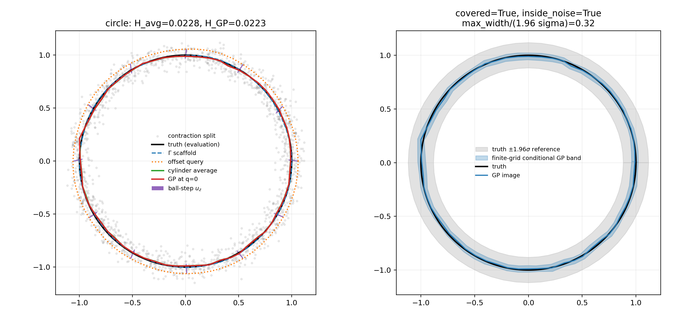
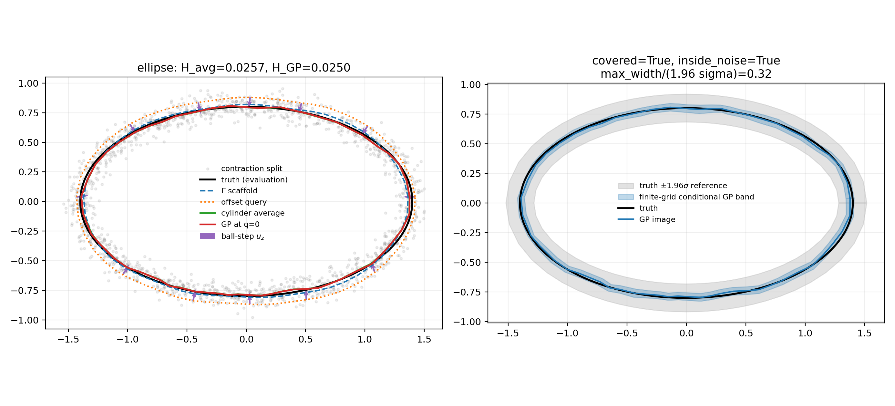

# GP contraction diagnostic

This experiment compares the original cylinder average with a scalar GP
prediction at projected coordinate `q=0`. Both estimators use the same
Yao ball-step direction and exactly the same cylinder observations. The
independent first split supplies only the closed query scaffold.

The GP regression uses the Dunson--Wu zero-mean covariance and pooled empirical-Bayes rule.

## Frozen setup

- `n=3000`, `sigma=0.06`, `20` Monte Carlo replicates per manifold;
- query offset `c_offset*sigma=1.0*sigma`;
- pooled empirical Bayes estimates `A`, `rho`, and the working noise SD from all 60 local regressions in each replicate;
- zero GP prior mean and kernel `A exp(-||q-q'||^2/rho)`;
- finite-grid Bonferroni multiplier for UQ visualization.

This transfers the GP regression rule in [Dunson--Wu, arXiv:2110.07478v4](https://arxiv.org/html/2110.07478v4) into the Yao-cylinder coordinates. It is not the complete MrGap tangent-chart algorithm.

The log-scale optimizer uses the predeclared bounds `A in [1e-3 sigma^2, 100 sigma^2]`, `rho in [0.01(2r^2), 100(2r^2)]`, and `tau in [0.1 sigma, 3 sigma]`.

## Point-estimation results

| manifold | mean H_avg | mean H_GP | median H_avg | median H_GP | fraction H_GP < H_avg |
|---|---:|---:|---:|---:|---:|
| circle | 0.02652 | 0.02473 | 0.02762 | 0.02380 | 0.80 |
| ellipse | 0.03027 | 0.02829 | 0.02909 | 0.02719 | 0.90 |

Under this predeclared fitting rule, the GP improves mean Hausdorff error on both geometries. It beats the shared-cylinder average in
80% of circle replicates and
90% of ellipse replicates. The
ellipse top-curvature quartile has only a small positive mean local-error
difference (0.00103)
in favor of GP. With only 20 replicates, these are mechanism-test results
rather than a final comparison.

## Fitted covariance parameters

| manifold | mean A | mean rho | mean working noise SD | optimizer success | fit at a bound |
|---|---:|---:|---:|---:|---:|
| circle | 0.00493314 | 0.277862 | 0.0614971 | 1.00 | 0.00 |
| ellipse | 0.0057152 | 0.229121 | 0.0620112 | 1.00 | 0.00 |

The comparison estimates the empirical difference between
`E[s | Y in V_z]` and a GP estimate of `E[s | q=0]`. The ellipse curvature
figure is post-hoc: curvature never enters either estimator.

For a local quadratic graph, cylinder averaging and axis prediction target
different conditional functionals. Their gap includes transverse-window,
noisy-coordinate, selection, and direction-estimation effects. This
experiment does not identify any one of these as the cause of the gap.

## Conditional UQ diagnostics

| manifold | posterior coverage | frequentist-mean coverage | mean s_post/s_F | max s_post/s_F | posterior tube inside noise band |
|---|---:|---:|---:|---:|---:|
| circle | 0.95 | 0.95 | 1.020 | 1.062 | 1.00 |
| ellipse | 0.85 | 0.85 | 1.024 | 1.076 | 1.00 |

These are finite-grid conditional GP simultaneous bands. The posterior SD
and `tau*||a_z||` quantify different uncertainties and are reported
separately. Empirical inclusion here is a simulation diagnostic, not an
honest true-manifold confidence theorem. A maximum half-width below
`1.96*sigma` also does not imply geometric containment; containment is
checked from the dense band boundaries.

## Representative fitted bands

The right panels compare the true manifold (black), fitted GP image (blue), finite-grid GP band (translucent blue), and the `1.96*sigma` observation-noise reference band (grey).

**Circle, replicate 0.** The title reports whether the band covers the truth, lies inside the noise band, and its relative maximum half-width.

**Ellipse, replicate 0.** The same three diagnostics appear in the title. These representative plots do not replace the Monte Carlo coverage rates above.

## Neighborhood diagnostics

| manifold | mean median cylinder n | minimum cylinder n | ball fallback fraction | cylinder fallback fraction | high-curvature GP improvement |
|---|---:|---:|---:|---:|---:|
| circle | 46.8 | 26 | 0.0000 | 0.0000 | 0.00047 |
| ellipse | 41.9 | 24 | 0.0000 | 0.0000 | 0.00103 |

The last column uses the top curvature quartile. It is most meaningful for
the ellipse; the circle has constant curvature and acts as a control.
